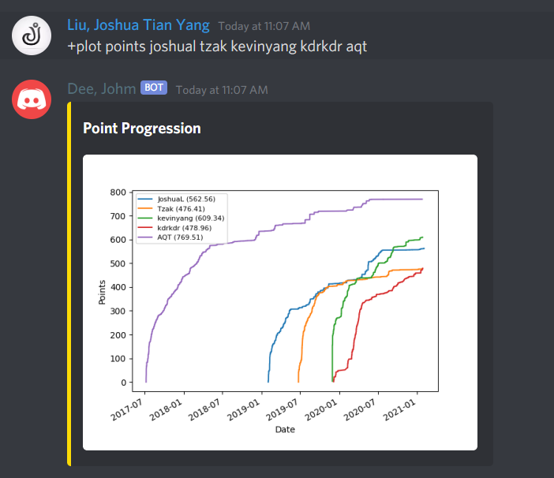
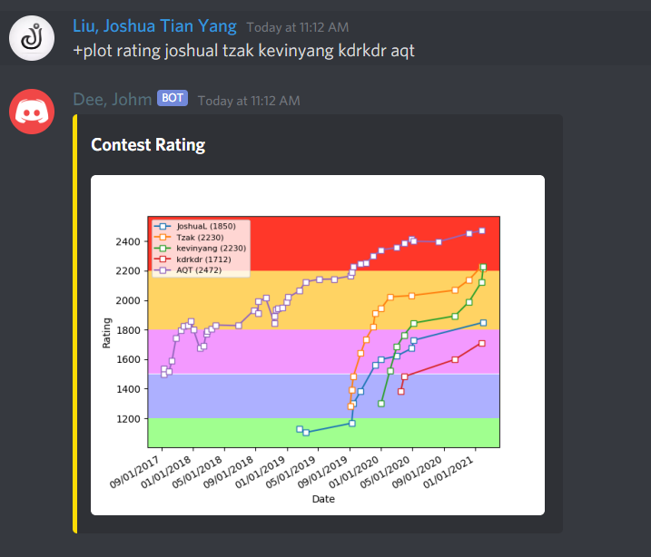

# JOMD
JOMD is a Discord bot for [Dmoj](https://dmoj.ca/) Inspired by [TLE](https://github.com/cheran-senthil/TLE)

**Add the bot [here](https://discord.com/api/oauth2/authorize?client_id=725004198466551880&permissions=73792&scope=bot)!**

## Previews
Point history



Rating history



Point prediction


# Features
The features of JOMD are split up into seperate cogs each handling their related commands.

### User Cog
```
  cache      Caches the submissions of a user, will speed up other commands
  gimme      Recommend a problem
  predict    Predict total points after solving N pointer problem(s)
  user       Show user profile and latest submissions
  vc         Suggest a contest
```

### Plot Cog
```
  points Plot point progression
  rating Plot rating progression
  type   Graph problems solved by popular problem types
```

### Handles Cog

```
  link       Links your discord account to your dmoj account
  set        Manually link two accounts together
  unlink     Unlink your discord account with your dmoj account
  whois      Shows the discord account linked to the relevant dmoj account
```

# Setup

To setup the bot first clone the repository and cd into it

```
git clone https://github.com/JoshuaTianYangLiu/JOMD.git
cd JOMD
```


Make sure you have python3.7 installed.

```
apt-get install python3.7
```

Install relevant packages

```
pip3.7 install -r requirements.txt
```

Add your discord bot token with

```
export JOMD_BOT_TOKEN="INSERT BOT TOKEN HERE"
```

If you also want to add your DMOJ api token use

```
export JOMD_TOKEN="INSERT DMOJ API TOKEN HERE"
```

**JOMD also uses SQLAlchemy as a orm and Alembic as a migration tool. You need to make sure the database is upto date**

**If you have cloned this repository before the addition of Alembic, find the corresponding hash in /alembic and run**

```
alembic stamp <HASH>
```

Then run

```
alembic upgrade head
```

Run the bot with

```
python3.7 Main.py
```


**Warning**: Many of the commands require multiple pieces of information to be fetched, so many initial commands will take several seconds to run but will speed up as more information is fetched and stored.

# Usage
To use the bot, use the `+` prefix

# Contributing
Pull requests are welcomed and encouraged.
